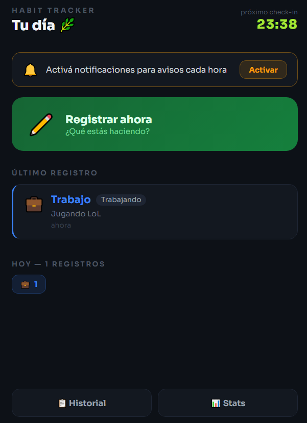
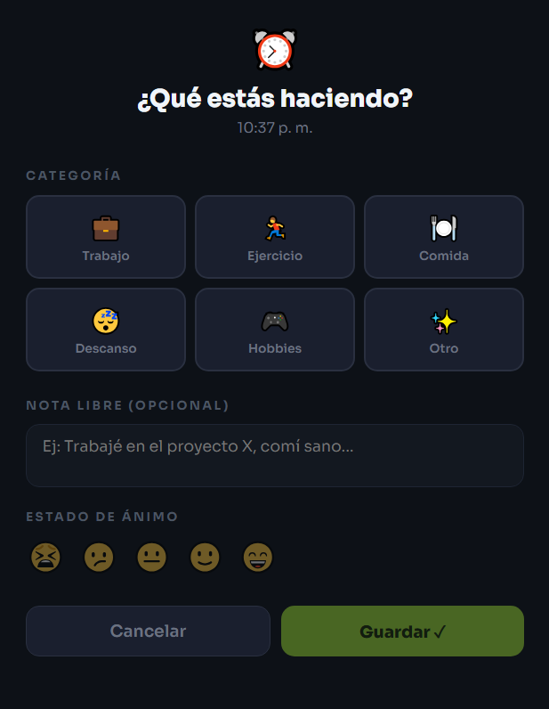
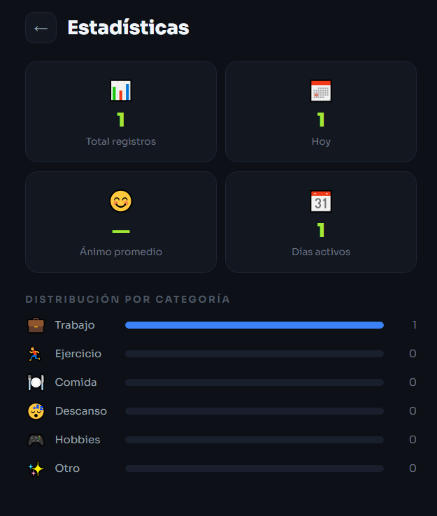

# 🌿 Habit Tracker

Aplicación web mobile-first para registrar hábitos y actividades a lo largo del día. Permite hacer check-ins rápidos, ver el historial y analizar estadísticas personales.

> Proyecto personal desarrollado como práctica de desarrollo frontend vanilla (HTML, CSS, JavaScript puro).

---

## ✨ Funcionalidades

- **Check-in rápido** — registrá tu actividad actual en segundos eligiendo categoría, actividad y estado de ánimo
- **Recordatorio automático** — countdown al próximo check-in y notificaciones cada hora (si se activan)
- **Historial completo** — todos tus registros con hora, actividad y nota libre
- **Estadísticas** — distribución de actividades por categoría, ánimo promedio y días activos
- **Persistencia local** — los datos se guardan en el navegador (localStorage), sin necesidad de servidor ni cuenta

---

## 📸 Capturas

<!-- Reemplazá estas líneas con capturas reales de la app -->
| Home | Check-in | Estadísticas |
|------|----------|--------------|
|  |  |  |

---

## 🗂️ Categorías disponibles

| Emoji | Categoría | Ejemplos |
|-------|-----------|---------|
| 💼 | Trabajo | Trabajando, Reunión, Estudiando |
| 🏃 | Ejercicio | Ejercitando, Caminando, Estirando |
| 🍽️ | Comida | Desayunando, Almorzando, Snack |
| 😴 | Descanso | Durmiendo, Meditando, Siesta |
| 🎮 | Hobbies | Juegos, Música, Lectura |
| ✨ | Otro | Transporte, Social, Compras |

---

## 🛠️ Tecnologías

- HTML5
- CSS3 (variables, animaciones, grid, flexbox)
- JavaScript vanilla (sin frameworks ni dependencias)
- Web Notifications API
- localStorage para persistencia de datos

---

## 🚀 Cómo usarlo

No requiere instalación ni servidor. Solo abrí el archivo en el navegador:

```bash
git clone https://github.com/OrlezTh/habit-tracker.git
cd habit-tracker
# Abrí index.html en tu navegador
```

O si preferís con live server:

```bash
npx serve .
```

---

## 📁 Estructura

```
habit-tracker/
├── index.html        # App completa (single file)
└── screenshots/      # Capturas de pantalla (opcional)
```

---

## 💡 Decisiones técnicas

- **Single file** — toda la app en un único `index.html` para máxima portabilidad
- **Sin dependencias** — cero librerías externas, carga instantánea
- **Mobile-first** — diseñado para usarse desde el celular durante el día
- **Dark mode nativo** — UI oscura optimizada para uso nocturno

---

## 👤 Autor

**Thiago Alvarez**  
[GitHub](https://github.com/OrlezTh) · [LinkedIn](https://www.linkedin.com/in/thiagoorel/)
